# Runwal Seagull Society Management Portal - Product Specifications

**Version**: 1.0  
**Last Updated**: January 18, 2026  
**Product Owner**: Runwal Seagull Society  
**Document Type**: Product Requirements Document (PRD)

---

## 📋 Table of Contents

1. [Executive Summary](#executive-summary)
2. [Product Vision & Goals](#product-vision--goals)
3. [User Personas & Roles](#user-personas--roles)
4. [Feature Specifications](#feature-specifications)
5. [User Workflows](#user-workflows)
6. [Data Models](#data-models)
7. [Business Rules](#business-rules)
8. [Non-Functional Requirements](#non-functional-requirements)
9. [Future Enhancements](#future-enhancements)

---

## Executive Summary

### Product Overview

Runwal Seagull Society Management Portal is a comprehensive web-based platform designed to streamline community management for residential societies. The platform facilitates communication, event management, user administration, and various community services through a modern, user-friendly interface.

### Key Value Propositions

1. **Centralized Communication**: Single platform for all society announcements and notices
2. **Event Management**: Simplified event creation, registration, and tracking
3. **User Management**: Multi-tier access control with approval workflows
4. **Community Services**: Neighbor directory, vehicle management, marketplace, and service listings
5. **Administrative Efficiency**: Streamlined workflows for society administrators

### Target Audience

- **Primary**: Residential societies with 50-500+ units
- **Users**: Society residents (owners and tenants), building administrators
- **Administrators**: Society management committee members

---

## Product Vision & Goals

### Vision Statement

To create a digital ecosystem that enhances community living by providing seamless access to society information, events, and services while empowering administrators with efficient management tools.

### Strategic Goals

1. **Engagement**: Increase resident participation in society events by 50%
2. **Efficiency**: Reduce administrative overhead by 40% through automation
3. **Transparency**: Provide real-time access to society information
4. **Communication**: Enable instant dissemination of urgent notices
5. **Community**: Foster stronger neighbor connections and interactions

### Success Metrics

| Metric | Target | Measurement Period |
|--------|--------|-------------------|
| Active User Rate | >70% | Monthly |
| Event Registration Rate | >60% | Per Event |
| Notice Read Rate | >80% | Per Notice |
| Admin Time Saved | >10 hrs/week | Monthly |
| User Satisfaction (NPS) | >40 | Quarterly |

---

## User Personas & Roles

### Role Hierarchy

```
┌─────────────────────────────────────┐
│            ADMIN                    │
│  (Full system access)              │
└────────────┬────────────────────────┘
             │
┌────────────┴────────────────────────┐
│      REGISTERED USERS               │
│  ┌──────────┬──────────────┐       │
│  │  OWNER   │   TENANT     │       │
│  │ (Resident)│  (Resident) │       │
│  └──────────┴──────────────┘       │
└────────────┬────────────────────────┘
             │
┌────────────┴────────────────────────┐
│           PUBLIC                    │
│  (Unauthenticated users)           │
└─────────────────────────────────────┘
```

### 1. Public User (Unauthenticated)

**Profile**: Prospective residents, visitors, general public

**Needs**:
- View public information about the society
- Learn about upcoming events
- Access registration process

**Permissions**:
- View landing page
- See public notices
- See upcoming public events
- Access registration form

### 2. Owner (Property Owner)

**Profile**: 
- Name: Rajesh Sharma
- Age: 42
- Occupation: Business Owner
- Tech Savviness: Medium
- Owns: Flat 302, Building A

**Goals**:
- Stay informed about society matters
- Participate in events
- Connect with neighbors
- Manage vehicles
- Access society services

**Pain Points**:
- Missing important notices
- Difficulty tracking event registrations
- Finding reliable service providers
- Lost vehicle ownership information

**Permissions**:
- All PUBLIC permissions
- View all registered-only content
- Register for events (individual/team)
- Access neighbor directory
- Manage own vehicles
- List items in marketplace
- Submit complaints
- Review service providers

### 3. Tenant (Renting Resident)

**Profile**:
- Name: Priya Desai
- Age: 28
- Occupation: IT Professional
- Tech Savviness: High
- Rents: Flat 504, Building B

**Goals**:
- Stay updated on society rules
- Participate in social events
- Find nearby services
- Report maintenance issues

**Pain Points**:
- Limited tenure reduces engagement
- Uncertainty about participation rights
- Need for temporary service access

**Permissions**:
- Same as OWNER role
- All features accessible equally

### 4. Admin (Society Committee Member)

**Profile**:
- Name: Mrs. Anjali Kulkarni
- Age: 55
- Role: Secretary, Management Committee
- Tech Savviness: Medium
- Responsibility: Overall society management

**Goals**:
- Efficiently manage user registrations
- Communicate important updates quickly
- Organize and track events
- Maintain society records
- Monitor complaints and resolutions

**Pain Points**:
- Time-consuming manual approval processes
- Difficulty tracking event participation
- Multiple communication channels
- Paper-based record keeping

**Permissions**:
- All user permissions
- Approve/reject user registrations
- Create and manage notices (all visibility levels)
- Create and manage events
- View and manage all registrations
- Export data (users, registrations)
- Manage buildings and flats
- Approve marketplace listings
- Assign and track complaints
- Manage service provider listings

---

## Feature Specifications

### Phase 1: Foundation & Infrastructure

#### F1.1: Database Schema

**Description**: Complete relational database design with 14 interconnected tables

**Tables**:
1. Users (residents, admins)
2. Buildings (society building information)
3. Flats (individual units)
4. Notices (announcements)
5. Events (community events)
6. EventRegistrations (event sign-ups)
7. Vehicles (resident vehicles)
8. MarketplaceAds (buy/sell listings)
9. Complaints (issue tracking)
10. ComplaintComments (complaint discussions)
11. ComplaintStatusHistory (audit trail)
12. YellowPages (service providers)
13. YellowPageReviews (service ratings)
14. ActivityLogs (system audit)

**Key Relationships**:
- User → Building (many-to-one)
- User → Flat (many-to-one)
- User → Vehicles (one-to-many)
- Event → EventRegistrations (one-to-many)
- User → EventRegistrations (one-to-many)

#### F1.2: Authentication System

**Provider**: NextAuth.js v5 (Beta)

**Authentication Flow**:
1. User submits email/password
2. System validates credentials
3. Password verified using bcrypt
4. User status checked (PENDING/APPROVED/SUSPENDED/REJECTED)
5. Session created with user metadata
6. JWT token issued

**Security Features**:
- Bcrypt password hashing (12 rounds)
- Secure session management
- CSRF protection
- HTTP-only cookies
- Automatic session expiry

**Account States**:
| Status | Login Allowed | Dashboard Access | Admin Action Required |
|--------|---------------|------------------|----------------------|
| PENDING | ❌ | ❌ | Approval needed |
| APPROVED | ✅ | ✅ | None |
| SUSPENDED | ❌ | ❌ | Reactivation needed |
| REJECTED | ❌ | ❌ | Re-application needed |

---

### Phase 2: Authentication & User Management

#### F2.1: User Registration

**User Story**: As a new resident, I want to register an account so that I can access society services.

**Acceptance Criteria**:
1. Form collects: name, email, password, phone, building, flat, user type
2. Email validation (format and uniqueness)
3. Password strength: min 6 characters
4. Phone validation: min 10 digits
5. Building selection from active buildings only
6. Flat number: exactly 4 characters
7. User type: OWNER or TENANT
8. Account created with PENDING status
9. Redirect to pending approval page
10. Admin notification (future)

**Validation Rules**:
```typescript
- Name: min 2 characters
- Email: valid email format, unique in system
- Phone: min 10 digits, format flexible
- Password: min 6 characters (strengthen in production)
- Building: must exist and be active for registration
- Flat: 4-character code, auto-create if doesn't exist
- User Type: enum ['OWNER', 'TENANT']
```

**Data Flow**:
```
User Form → Validation → Create User (status: PENDING) → 
Create/Link Flat → Send Confirmation → Redirect to Pending Page
```

#### F2.2: User Login

**User Story**: As a registered user, I want to log in securely to access my dashboard.

**Acceptance Criteria**:
1. Email and password fields
2. Client-side validation
3. Server-side credential verification
4. Status check (must be APPROVED)
5. Session creation on success
6. Redirect to dashboard
7. Error messages for invalid credentials
8. Specific messages for pending/suspended accounts

**Error Handling**:
| Scenario | Error Message | UI Behavior |
|----------|--------------|-------------|
| Invalid email | "Invalid email address" | Field highlight |
| Wrong password | "Invalid credentials" | Generic message |
| User not found | "Invalid credentials" | Generic message |
| Pending approval | "Account pending approval" | Info message |
| Suspended account | "Account suspended" | Warning message |

#### F2.3: Admin User Approval

**User Story**: As an admin, I want to review and approve new user registrations to maintain security.

**Acceptance Criteria**:
1. Admin can view all pending users
2. Display user details: name, email, building, flat, user type
3. One-click approve action
4. One-click reject action
5. Optional approval notes
6. Status updates in real-time
7. Activity logged
8. Email notification (future)

**Admin Interface**:
- Filter by status (Pending/Approved/Suspended/Rejected)
- Search by name, email, flat
- Bulk actions (future)
- Audit trail visible

#### F2.4: User Profile Management

**User Story**: As a user, I want to view and update my profile information.

**Acceptance Criteria**:
1. View current profile data
2. Update name
3. Update phone number
4. Upload profile image (Cloudinary)
5. View building and flat (read-only)
6. View account status
7. Toggle profile visibility (public/private)
8. Changes saved and reflected immediately

**Editable Fields**:
- Name
- Phone number
- Profile image
- Profile visibility

**Read-Only Fields**:
- Email
- Building
- Flat
- User type
- Status
- Registration date

---

### Phase 3: Public Pages

#### F3.1: Landing Page

**User Story**: As a visitor, I want to see an attractive landing page with society information.

**Sections**:
1. **Hero Section**: 
   - Headline: "Smart Living for Modern Communities"
   - Tagline
   - CTA buttons: "Get Started", "Sign In"

2. **Features Showcase**:
   - Notice Board
   - Event Management
   - Neighbor Directory
   - Vehicle Management
   - Yellow Pages

3. **Statistics**:
   - Total Residents
   - Active Events
   - Buildings
   - Community Rating

4. **Latest Notices** (Public visibility):
   - Display 3 most recent
   - Notice type badges
   - Click to view details

5. **Upcoming Events** (Public):
   - Display upcoming 3 events
   - Event type icons
   - Date and venue
   - "Login to Register" CTA

6. **Footer**:
   - Quick links
   - Contact details
   - Social media

**Design Requirements**:
- Responsive (mobile, tablet, desktop)
- Fast loading (<3s)
- Accessible (WCAG 2.1 AA)
- SEO optimized

#### F3.2: Public Notices Section

**User Story**: As a visitor, I want to see public notices without logging in.

**Acceptance Criteria**:
1. Display notices where visibility = PUBLIC and published = true
2. Show notice type badge (General, Urgent, Maintenance, Event)
3. Display title, excerpt, and date
4. Click notice to view full content
5. Modal/detail view shows:
   - Full content (rich text)
   - Attachments (download links)
   - Posted date
   - Notice type
6. Pagination (10 per page)
7. Sort by date (newest first)

**Notice Types and Colors**:
| Type | Badge Color | Use Case |
|------|------------|----------|
| GENERAL | Blue | Regular announcements |
| URGENT | Red | Critical information |
| MAINTENANCE | Yellow | Scheduled maintenance |
| EVENT | Green | Event-related notices |

#### F3.3: Public Events Section

**User Story**: As a visitor, I want to see upcoming events to know about society activities.

**Acceptance Criteria**:
1. Display only published events
2. Show only future events (endDate >= today)
3. Event card shows:
   - Title
   - Event type (Festival, Sports, Cultural, Meeting, Social)
   - Start date and time
   - Venue
   - Image (if available)
   - Registration status
4. "Login to Register" button for anonymous users
5. Grid layout (responsive)
6. Load more functionality

**Event Type Icons**:
- Festival: 🎉
- Sports: ⚽
- Cultural: 🎭
- Meeting: 📋
- Social: 🤝
- Other: 📅

---

### Phase 4: Registered User Features

#### F4.1: User Dashboard

**User Story**: As a logged-in user, I want a personalized dashboard showing my activity and updates.

**Dashboard Widgets**:

1. **Welcome Card**:
   - Greeting with user name
   - Profile completeness indicator
   - Quick action buttons

2. **Quick Stats**:
   - My Registrations (count)
   - Unread Notices (count)
   - Upcoming Events (count)
   - Active Complaints (count)

3. **Recent Notices** (Top 5):
   - Title and date
   - Click to view
   - "View All" link

4. **My Upcoming Events** (Next 3):
   - Event details
   - Registration status
   - Countdown timer

5. **Quick Actions**:
   - Register Vehicle
   - Create Ad
   - Submit Complaint
   - Find Service

**Access Control**:
- Only APPROVED users can access
- PENDING users redirected to pending page
- SUSPENDED users cannot login

#### F4.2: Notice Board (Registered Users)

**User Story**: As a registered user, I want to see all notices relevant to me.

**Visibility Levels**:
| Level | Accessible By | Use Case |
|-------|--------------|----------|
| PUBLIC | Everyone | General public notices |
| REGISTERED | OWNER, TENANT, ADMIN | Resident-only information |
| ADMIN | ADMIN only | Internal communications |

**Features**:
1. View all notices (PUBLIC + REGISTERED for user role)
2. Filter by type (General, Urgent, Maintenance, Event)
3. Search by title/content
4. Pagination (10 per page)
5. Click to view full notice
6. Download attachments
7. Mark as read (future)

**Notice Detail View**:
- Full rich-text content
- Attachments with download buttons
- Posted by (admin name)
- Posted date
- Last updated date
- Notice type badge

#### F4.3: Event Management (User View)

**User Story**: As a user, I want to browse events and register for ones I'm interested in.

**Event Listing**:
1. Filter options:
   - All Events
   - Upcoming
   - Past
   - My Registrations
2. Event type filter
3. Search by title/description
4. Pagination

**Event Card Information**:
- Title and description
- Event type icon
- Date and time
- Venue
- Registration required?
- Registration status:
  - Not Started (future registration)
  - Open (can register)
  - Full (max participants reached)
  - Closed (past deadline)
  - Registered (user already registered)
- Participant count / Max participants
- Event image

**Registration Flow - Individual**:
1. Click "Register" on event
2. Confirm registration dialog
3. Optional: Add notes
4. Submit registration
5. Success confirmation
6. Event appears in "My Registrations"
7. Dashboard updated

**Registration Flow - Team**:
1. Click "Register" on team event
2. Form to add team members:
   - Member name
   - Member email (optional)
   - Member phone (optional)
   - Add/Remove member buttons
3. Minimum team size validation
4. Submit registration
5. Confirmation with team details
6. Email to team members (future)

**Registration Validation**:
- Event must be published
- Registration must be open (within date range)
- Slots available (if max participants set)
- User not already registered
- Team events require team members

**Cancel Registration**:
- Available only before event starts
- Confirmation dialog
- Slot freed for others
- Removed from "My Registrations"

**My Registrations View**:
- List of all user's registrations
- Filter: Upcoming, Past, Cancelled
- Event details
- Team members (for team events)
- Cancel button (if applicable)
- Export to calendar (future)

#### F4.4: Neighbor Directory

**User Story**: As a user, I want to find and connect with my neighbors.

**Features**:
1. Search by:
   - Building
   - Flat number
   - Name
2. Filter by:
   - User type (Owner/Tenant)
   - Building
3. Privacy respected:
   - Only show users with isProfilePublic = true
   - Hide phone/email if profile private

**Neighbor Card Display**:
- Name
- Building & Flat
- User type badge (Owner/Tenant)
- Profile image
- Contact button (if public)
- Since: Registration date

**Privacy Controls**:
- User can toggle profile visibility in settings
- Private profiles: Name and flat visible, contact info hidden
- Public profiles: All info visible

#### F4.5: Vehicle Management

**User Story**: As a user, I want to register my vehicles and search for vehicle owners.

**My Vehicles**:
1. List all user's vehicles
2. Add vehicle:
   - Vehicle number (unique, uppercase)
   - Type (Car, Bike, Scooter, Other)
   - Brand
   - Model
   - Color
   - Parking slot (optional)
3. Edit vehicle details
4. Delete vehicle
5. Validation: No duplicate vehicle numbers

**Vehicle Search** (Public):
1. Search by vehicle number
2. Results show:
   - Owner name
   - Building & Flat
   - Contact number (if profile public)
   - Vehicle details
3. No results: "Vehicle not found"
4. Use case: Wrongly parked vehicle, find owner

---

### Phase 5: Admin Portal

#### F5.1: Admin Dashboard

**User Story**: As an admin, I want an overview of all society activities and pending actions.

**Admin Dashboard Widgets**:

1. **Stats Overview**:
   - Total Users (by status)
   - Pending Approvals
   - Total Events
   - Active Events
   - Total Notices
   - Open Complaints
   - Buildings & Flats

2. **Pending Registrations** (Top 5):
   - Name, email, flat
   - Quick approve/reject buttons
   - "View All" link

3. **Recent Activity Feed**:
   - New registrations
   - Event registrations
   - Complaints submitted
   - Timestamps

4. **Quick Actions**:
   - Create Notice
   - Create Event
   - Manage Users
   - View Complaints

5. **Upcoming Events**:
   - Next 5 events
   - Registration count
   - Manage link

**Access Control**:
- Only users with role = ADMIN
- Non-admin access redirected to user dashboard

#### F5.2: Notice Management (Admin)

**User Story**: As an admin, I want to create and manage society notices efficiently.

**Notice List (Admin)**:
1. View all notices (regardless of visibility)
2. Filter by:
   - Visibility (Public, Registered, Admin)
   - Type (General, Urgent, Maintenance, Event)
   - Status (Published, Draft)
3. Search by title/content
4. Sort by date
5. Actions: Edit, Delete, Publish/Unpublish

**Create Notice**:
1. Title (max 200 chars)
2. Rich text editor for content:
   - Bold, italic, underline
   - Headings (H1-H6)
   - Lists (ordered, unordered)
   - Links
   - Images (inline)
3. Notice type selection
4. Visibility level selection
5. Attachment upload (PDF, Images):
   - Via Cloudinary
   - Multiple files support
   - File size limit: 10MB per file
6. Save as Draft or Publish
7. Published: Set publishedAt timestamp

**Edit Notice**:
- Update any field
- Save changes
- Publish draft
- Unpublish published notice

**Delete Notice**:
- Confirmation dialog
- Permanent deletion
- Can't delete if referenced (future constraint)

#### F5.3: Event Management (Admin)

**User Story**: As an admin, I want to create events and manage registrations.

**Event List (Admin)**:
1. View all events (published and draft)
2. Filter by:
   - Status (Published, Draft)
   - Event type
   - Date range
3. Search
4. Actions: View, Edit, Manage Registrations, Delete

**Create Event**:
1. **Basic Info**:
   - Title (max 200 chars)
   - Description (rich text)
   - Event type
   - Venue

2. **Date & Time**:
   - Start date
   - End date
   - Validation: End >= Start

3. **Registration Settings**:
   - Enable registration? (checkbox)
   - If enabled:
     - Registration start date
     - Registration end date
     - Participation type (Individual/Team)
     - Max participants (optional)

4. **Media**:
   - Upload event image (Cloudinary)
   - Image displayed on event card

5. **Status**:
   - Save as Draft
   - Publish

**Edit Event**:
- All fields editable
- Validation: Can't reduce max participants below current registrations
- Warning if editing published event with registrations

**Delete Event**:
- Can't delete if has registrations (data integrity)
- Confirmation required
- Alternative: Unpublish event

**Manage Event Registrations**:
1. View all registrations for event
2. Registration details:
   - User name, email, building, flat
   - Registration date
   - Team members (if team event)
   - Additional notes
3. Search registrations
4. Export to CSV:
   - All registration data
   - Team member details flattened
5. Close registration manually
6. Send notification to all registrants (future)

**Registration CSV Format**:
```
Name, Email, Building, Flat, Phone, Registration Date, Team Members, Notes
```

#### F5.4: User Management (Admin)

**User Story**: As an admin, I want to manage all user accounts and their access levels.

**User List (Admin)**:
1. View all users
2. Filter by:
   - Role (Admin, Owner, Tenant, Public)
   - Status (Pending, Approved, Suspended, Rejected)
   - Building
3. Search by:
   - Name
   - Email
   - Flat number
4. Sort by registration date, name
5. Pagination

**User Actions**:

1. **View User Details**:
   - Full profile information
   - Activity logs
   - Registrations
   - Vehicles
   - Marketplace ads
   - Complaints

2. **Approve User**:
   - Changes status to APPROVED
   - User can now login
   - Email notification (future)
   - Activity logged

3. **Reject User**:
   - Changes status to REJECTED
   - User cannot login
   - Reason (optional)
   - Email notification (future)

4. **Suspend User**:
   - Changes status to SUSPENDED
   - User logged out immediately
   - Cannot login until reactivated
   - Reason required
   - Activity logged

5. **Reactivate User**:
   - Changes SUSPENDED → APPROVED
   - User can login again
   - Email notification (future)

6. **Make Admin**:
   - Changes role to ADMIN
   - User gets admin privileges
   - Confirmation required
   - Activity logged

7. **Remove Admin**:
   - Changes role back to OWNER/TENANT
   - Admin privileges revoked
   - Confirmation required
   - Can't demote self

8. **Reset Password**:
   - Generate temporary password
   - Display to admin (copy button)
   - User must change on next login (future)
   - Email temp password (future)

**Restrictions**:
- Admin cannot suspend themselves
- Admin cannot demote themselves
- Must have at least one admin in system

**Export Users**:
- Export all users to CSV
- Columns: Name, Email, Phone, Building, Flat, Role, Status, Registration Date

**Activity Logs**:
- View user's activity history
- Login attempts
- Profile updates
- Registrations
- Complaints
- Admin actions on user

---

### Future Features (Phase 6+)

#### F6.1: Complaint Management

**Features**:
- Submit complaint with category
- Upload images
- Track status (Submitted → Assigned → In Progress → Resolved → Closed)
- Admin assignment
- Comments and updates
- Resolution photos
- Priority levels
- SLA tracking

#### F6.2: Marketplace

**Features**:
- List items for sale/rent
- Categories: Furniture, Electronics, Services, etc.
- Images and price
- Contact seller
- Mark as sold
- Admin moderation

#### F6.3: Yellow Pages (Service Directory)

**Features**:
- List trusted service providers
- Categories: Plumber, Electrician, Doctor, etc.
- Contact details
- User ratings and reviews
- Admin approval required
- Search and filter

#### F6.4: Advanced Features

- **Email Notifications**: Event reminders, notice alerts
- **SMS Alerts**: For urgent notices
- **Document Library**: Society documents, forms
- **Meeting Scheduler**: Book common areas
- **Payment Integration**: Maintenance payments
- **Mobile App**: iOS and Android native apps
- **Analytics Dashboard**: Usage statistics, engagement metrics

---

## User Workflows

### Workflow 1: New User Onboarding

```mermaid
graph TD
    A[Visit Landing Page] --> B[Click Get Started]
    B --> C[Fill Registration Form]
    C --> D{Form Valid?}
    D -->|No| C
    D -->|Yes| E[Submit]
    E --> F[Account Created - Status: PENDING]
    F --> G[Redirect to Pending Approval Page]
    G --> H[Admin Receives Notification]
    H --> I[Admin Reviews Registration]
    I --> J{Approved?}
    J -->|Yes| K[Status → APPROVED]
    J -->|No| L[Status → REJECTED]
    K --> M[User Receives Email]
    M --> N[User Logs In]
    N --> O[Access Dashboard]
```



### Workflow 2: Event Registration


### Workflow 3: Notice Creation (Admin)


---

## Data Models

### User Status State Machine

```
         ┌──────────┐
         │          │
    ┌───▶│ PENDING  │◀───┐
    │    │          │    │
    │    └────┬─────┘    │
    │         │          │
    │    ┌────▼─────┐    │
    │    │          │    │
Re-apply │ APPROVED │    │
    │    │          │    │
    │    └────┬─────┘    │
    │         │          │
    │    ┌────▼─────┐    │
    │    │          │    │
    └────│SUSPENDED │    │
         │          │    │
         └──────────┘    │
                         │
         ┌──────────┐    │
         │          │    │
         │ REJECTED │────┘
         │          │
         └──────────┘
```

### Event Registration Lifecycle

```
┌─────────────────┐     ┌─────────────────┐     ┌─────────────────┐
│                 │     │                 │     │                 │
│  NOT_STARTED    │────▶│      OPEN       │────▶│     CLOSED      │
│                 │     │                 │     │                 │
└─────────────────┘     └────────┬────────┘     └─────────────────┘
                                 │
                        ┌────────▼────────┐
                        │                 │
                        │      FULL       │
                        │                 │
                        └─────────────────┘
```

---

## Business Rules

### Registration Rules

1. **Email Uniqueness**: Each email can only register once
2. **Building Selection**: Only active buildings appear in dropdown
3. **Flat Assignment**: 
   - Flat number automatically linked to building
   - If flat doesn't exist, create new flat record
   - Multiple users can claim same flat (owner + tenant)
4. **User Type**: Each user must specify OWNER or TENANT
5. **Initial Status**: All new registrations start as PENDING
6. **Login Restriction**: Only APPROVED users can login

### Event Registration Rules

1. **Registration Period**: 
   - Can only register between registrationStartDate and registrationEndDate
2. **Maximum Capacity**:
   - If maxParticipants set, block when limit reached
3. **Team Events**:
   - Must provide at least one team member
   - Team size limits (future)
4. **Duplicate Prevention**:
   - One registration per user per event
5. **Cancellation**:
   - Can only cancel before event startDate

### Notice Visibility Rules

1. **PUBLIC**: Visible to everyone (unauthenticated + all users)
2. **REGISTERED**: Visible to OWNER, TENANT, ADMIN only
3. **ADMIN**: Visible to ADMIN only
4. **Draft Notices**: Not visible to anyone except admins
5. **Published Notices**: Visible according to visibility level

### Admin Privilege Rules

1. **Self-Actions**:
   - Cannot suspend own account
   - Cannot demote own admin role
2. **Data Integrity**:
   - Cannot delete events with registrations
   - Cannot reduce max participants below current count
3. **Audit Trail**:
   - All admin actions logged with timestamp and actor

---

## Non-Functional Requirements

### Performance

| Metric | Target | Measurement |
|--------|--------|-------------|
| Page Load Time | <3s | Lighthouse |
| API Response | <500ms | Server logs |
| Database Query | <100ms | Prisma metrics |
| Concurrent Users | 500+ | Load testing |

### Security

1. **Authentication**:
   - Bcrypt password hashing (cost: 12)
   - JWT session tokens
   - HTTP-only cookies
   - CSRF protection

2. **Authorization**:
   - Role-based access control (RBAC)
   - Route protection middleware
   - Server-side permission checks

3. **Data Protection**:
   - SQL injection prevention (Prisma ORM)
   - XSS protection (input sanitization)
   - File upload validation
   - Rate limiting (future)

4. **Privacy**:
   - User profile visibility toggle
   - GDPR compliance (future)
   - Data export capability
   - Right to deletion (future)

### Scalability

1. **Database**:
   - PostgreSQL (horizontal scaling possible)
   - Connection pooling (Supabase)
   - Indexed queries
   - Pagination for large datasets

2. **Application**:
   - Serverless architecture (Vercel)
   - Static page generation where possible
   - Image optimization (Cloudinary CDN)
   - Lazy loading

3. **File Storage**:
   - Cloudinary for images
   - CDN delivery
   - Automatic optimization

### Reliability

1. **Uptime**: 99.5% target
2. **Backup**: 
   - Database: Automatic backups (Supabase)
   - Frequency: Daily
   - Retention: 7 days
3. **Error Handling**:
   - Graceful degradation
   - User-friendly error messages
   - Server-side logging
4. **Monitoring**:
   - Vercel Analytics
   - Error tracking (future: Sentry)

### Usability

1. **Responsive Design**:
   - Mobile-first approach
   - Breakpoints: 320px, 768px, 1024px, 1440px
   - Touch-friendly (44px minimum tap targets)

2. **Accessibility**:
   - WCAG 2.1 Level AA compliance
   - Keyboard navigation
   - Screen reader support
   - Color contrast ratios
   - Alt text for images

3. **Browser Support**:
   - Chrome (last 2 versions)
   - Firefox (last 2 versions)
   - Safari (last 2 versions)
   - Edge (last 2 versions)

4. **Internationalization**:
   - English (primary)
   - Future: Hindi, Marathi

---

## Future Enhancements

### Phase 6: Communication

- Email notifications for:
  - Registration approval
  - Event registrations
  - Notice publications
  - Complaint updates
- SMS alerts for urgent notices
- Push notifications (web push)
- In-app notification center

### Phase 7: Financial Management

- Maintenance payment tracking
- Payment gateway integration
- Receipt generation
- Outstanding balance tracking
- Payment reminders

### Phase 8: Facility Booking

- Book common areas (clubhouse, gym, party hall)
- Slot management
- Booking calendar
- Payment integration
- Booking confirmation

### Phase 9: Advanced Analytics

- Admin dashboard analytics
- User engagement metrics
- Event attendance trends
- Notice read rates
- Popular service providers

### Phase 10: Mobile Applications

- Native iOS app
- Native Android app
- Offline support
- Push notifications
- Biometric login

---

## Appendix

### Glossary

| Term | Definition |
|------|-----------|
| **Resident** | Owner or tenant living in the society |
| **Society** | Residential complex managed by the portal |
| **Building** | Physical structure within the society |
| **Flat** | Individual residential unit |
| **Notice** | Official announcement from management |
| **Event** | Society-organized activity |
| **Registration** | Sign-up for an event |
| **Yellow Pages** | Directory of service providers |
| **Marketplace** | Platform for buying/selling items |

### References

- [Next.js Documentation](https://nextjs.org/docs)
- [Prisma Documentation](https://www.prisma.io/docs)
- [NextAuth.js Documentation](https://next-auth.js.org)
- [Cloudinary Documentation](https://cloudinary.com/documentation)
- [Tailwind CSS Documentation](https://tailwindcss.com/docs)

---

**Document Control**

| Version | Date | Author | Changes |
|---------|------|--------|---------|
| 1.0 | 2026-01-18 | System Documentation | Initial comprehensive PRD |

**Approval**

| Role | Name | Signature | Date |
|------|------|-----------|------|
| Product Owner | | | |
| Technical Lead | | | |
| Stakeholder | | | |
